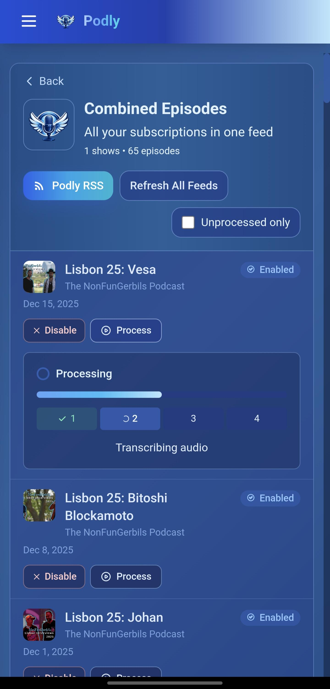

<div align="center">
  
  <h1>Podly</h1>
  <p>Ad-block for podcasts. Create an ad-free RSS feed.</p>
  
  <p>
    <a href="https://github.com/podly-pure-podcasts/podly_pure_podcasts"></a>
    <a href="https://github.com/podly-pure-podcasts/podly_pure_podcasts/blob/main/LICENCE"></a>
    <a href="https://discord.gg/FRB98GtF6N"></a>
  </p>
</div>

---

## What is Podly?

Podly automatically removes advertisements from podcasts using AI. Add your favorite shows, and Podly creates ad-free RSS feeds you can subscribe to in any podcast app.

<div align="center">
  
  <p><em>Dashboard showing podcast statistics and ad removal progress</em></p>
</div>

<div align="center">
  <table>
    <tr>
      <td></td>
      <td></td>
    </tr>
    <tr>
      <td align="center"><em>Mobile podcasts view</em></td>
      <td align="center"><em>Processed episode details</em></td>
    </tr>
  </table>
</div>

---

## Updates from Original App

### 🎨 Completely Redesigned UI
- Pastel unicorn theme with purple/pink gradients (light & dark mode)
- Episode-specific thumbnails in RSS feeds (when available from source)

### 🆕 First-Time User Onboarding
- Interactive tutorial on first login
- Step-by-step guide: find podcasts, enable episodes, subscribe in your app
- Explains auto-enable, auto-process, and on-demand processing
- "Replay Tutorial" option in Help modal

### 👥 Multi-User Authentication System
- Per-user feed subscriptions - each user sees only their podcasts
- Private subscriptions - hide your podcasts from other users
- Browse Podcasts on Server - discover feeds other users have added (unless made private)
- User-specific dashboard stats - see your own episodes processed and ad time saved
- Request access / signup flow with admin approval

### 📻 All-in-One Combined Feed
- Single RSS feed with all your subscribed podcasts combined
- Add one feed URL to your podcast app, get all your ad-free shows
- Feed uses Podly logo, episodes keep their original artwork
- Click "All-in-One Podly RSS" button on Podcasts page to copy the URL

### 🎛️ Prompt Presets System
- 3 built-in presets: Conservative, Balanced, Aggressive
- Custom presets - create your own ad detection prompts
- Per-show preset overrides - different presets for different podcasts
- Preset tracking - see which preset was used for each episode

### 📊 Enhanced Statistics & Monitoring
- Per-user statistics (admin) - episodes processed, downloads, ad time removed
- Processing progress indicators on episode cards

### ⚙️ Admin Controls
- Feed visibility controls - hide sensitive feeds from browse page
- Disable auto-process for all users on a feed
- Feed status badges - Public, Private, Hidden, Auto indicators
- User management - view all subscriptions and usage
- Database maintenance tools - repair processed paths after migrations
- Signup controls - enable/disable user registration

### 🔄 Auto-Process New Episodes
- Per-feed toggle to automatically process new episodes
- Shared across users - if anyone enables it, new episodes auto-process
- Visual indicators showing which feeds have auto-process enabled

### 📱 Mobile Optimizations
- Fully responsive design for phones and tablets
- Touch-friendly controls and modals
- Optimized layouts for small screens

---

## How It Works

1. **Add a podcast** — Paste an RSS feed URL or search the built-in podcast catalog
2. **Subscribe in your podcast app** — Copy the Podly RSS feed URL and add it to your app
3. **Trigger processing** — Tap the episode link in your podcast app to open the trigger page
4. **Wait for processing** — Podly transcribes the audio, detects ads, and removes them
5. **Listen ad-free** — Return to your podcast app and play the episode

### On-Demand Processing

Episodes are processed **only when you explicitly request it** by tapping the trigger link in the episode description. This prevents accidental processing from RSS readers or podcast app prefetching.

When you tap "Process this episode" in your podcast app:
1. A progress page opens showing processing status
2. When complete, close the tab and return to your podcast app
3. Refresh the feed and play the ad-free episode

### Authentication Modes and RSS Behavior

`REQUIRE_AUTH=true` is recommended for podcast app use.

- `REQUIRE_AUTH=true`: Podly generates tokenized RSS/feed links (`feed_token` + `feed_secret`). Podcast apps can use trigger and download links directly.
- `REQUIRE_AUTH=false`: Feed URLs are public and not tokenized. In the current release, trigger and download endpoints still rely on token/session auth, so podcast-app on-demand links may fail with auth-related errors.

If logs show `reason=not_whitelisted`, that episode is disabled for processing. Enable it in the Podcasts page first.

---

## Quick Start (Docker)

### Prerequisites
- Docker and Docker Compose
- LLM API key from [Groq](https://console.groq.com/keys) (free) or OpenAI/xAI

### 1. Clone and Configure

```bash
git clone https://github.com/podly-pure-podcasts/podly_pure_podcasts.git
cd podly_pure_podcasts
cp .env.local.example .env.local
```

Edit `.env.local`:

```bash
# Recommended: enable authentication for podcast-app trigger/download links
REQUIRE_AUTH=true
PODLY_ADMIN_USERNAME=admin
PODLY_ADMIN_PASSWORD=your-secure-password
PODLY_SECRET_KEY=replace-with-a-long-random-secret

# Local HTTP only (no HTTPS): required so login cookies work on localhost
# SESSION_COOKIE_SECURE=false
```

That's it for `.env.local`. After starting, open **Settings** in the web UI and enter your Groq API key in **Quick Setup** — it configures both transcription and ad detection in one step.

If you run with `REQUIRE_AUTH=true` on plain `http://` (no TLS), you must set `SESSION_COOKIE_SECURE=false`.  
If you are behind HTTPS (recommended), leave it unset.

### 2. Start

```bash
docker compose up -d --build
```

### 3. Access

Open http://localhost:5001

---

## Install as a Mobile App (PWA)

Podly can be installed as a Progressive Web App on your phone or tablet for a native app-like experience — no app store required.

### Android (Chrome)
1. Open your Podly server URL in Chrome
2. Tap the **three-dot menu** (⋮) → **"Add to Home screen"** or **"Install app"**
3. Confirm the installation
4. Podly appears on your home screen as a standalone app

### iOS (Safari)
1. Open your Podly server URL in Safari
2. Tap the **Share button** (📤) → **"Add to Home Screen"**
3. Tap **"Add"**
4. Podly appears on your home screen as a standalone app

> **Note:** Your Podly server must be served over HTTPS for PWA installation to work. If running locally without HTTPS, PWA install will not be available.

---

## Configuration

### LLM Providers

You can configure LLM providers via **Settings** in the web UI, or via environment variables in `.env.local`.

| Provider | Model | Notes |
|----------|-------|-------|
| **Groq** | `groq/openai/gpt-oss-120b` | Free tier, fast |
| **xAI Grok** | `xai/grok-3` | Recommended for accuracy (~$0.10/episode) |
| **OpenAI** | `gpt-4o` | High quality |
| **Anthropic** | `anthropic/claude-3-7-sonnet-latest` | High quality alternative |
| **Google Gemini** | `gemini/gemini-2.0-flash` | Fast, good value |

Models with a provider prefix (e.g. `groq/`, `xai/`, `anthropic/`) are routed automatically — no Base URL needed.

For xAI Grok via env vars:
```bash
LLM_API_KEY=xai-your-key
LLM_MODEL=xai/grok-3
# OPENAI_BASE_URL is optional — xai/ prefix auto-routes
```

> **Tip:** You can also save and manage encrypted API keys in **Settings → LLM Configuration** without editing env vars.

### Whisper (Transcription)

| Mode | Config | Notes |
|------|--------|-------|
| **Groq** | `WHISPER_TYPE=groq` | Fast, cheap, recommended |
| **Local** | `WHISPER_TYPE=local` | Free, requires RAM |

---

## Updating

```bash
cd podly_pure_podcasts
git pull
docker compose up -d --build
```

Database migrations run automatically on startup — no manual steps needed.

---

## Upgrading from Podly Pure Podcasts / Earlier Versions

If you're migrating from an older version of Podly, your `.env.local` likely has LLM settings that will **override** the new Settings UI.

### Clean up your `.env.local`

**Before (old-style — env vars control everything):**
```bash
GROQ_API_KEY=gsk_...
LLM_API_KEY=xai-...
LLM_MODEL=xai/grok-3
OPENAI_BASE_URL=https://api.x.ai/v1
WHISPER_TYPE=groq
```

**After (recommended — let the UI manage everything):**
```bash
# Auth (keep as-is)
REQUIRE_AUTH=true
PODLY_ADMIN_USERNAME=...
PODLY_ADMIN_PASSWORD=...
PODLY_SECRET_KEY=...
```

All LLM and Whisper settings are now configurable in **Settings** — no env vars needed.

**What changed and why:**

| Env var | Action | Reason |
|---------|--------|--------|
| `GROQ_API_KEY` | **Remove** | Enter your Groq key in **Settings → Quick Setup** instead. It's saved encrypted in the database and configures both Whisper and LLM. |
| `LLM_API_KEY` | **Remove** | Manage your LLM API key in **Settings → LLM Configuration**. You can save encrypted key profiles and switch providers without restarting. |
| `LLM_MODEL` | **Remove** | Select your model in the Settings UI. Env var overrides the UI if present. |
| `OPENAI_BASE_URL` | **Remove** | No longer needed — models with a provider prefix (e.g. `xai/grok-3`, `groq/...`) are routed automatically by LiteLLM. |
| `WHISPER_TYPE` | **Remove** | Select Whisper mode (groq/local/remote) in **Settings → Whisper**. Default is groq. |

> **Note:** If you prefer env vars over the UI, that still works — just be aware that any `GROQ_API_KEY`, `WHISPER_TYPE`, `LLM_MODEL`, `LLM_API_KEY`, or `OPENAI_BASE_URL` set in `.env.local` will override what you configure in Settings, and the UI will show a warning.

### After editing `.env.local`

```bash
docker compose restart
```

Then open **Settings → LLM Configuration** to select your provider, model, and API key source.

---

## Common Commands

```bash
# View logs
docker logs -f podly-pure-podcasts

# Restart
docker compose restart

# Stop
docker compose down

# Backup database
docker cp podly-pure-podcasts:/app/src/instance/sqlite3.db ./backup.db
```

---

## Development

```bash
# Frontend (hot reload)
cd frontend && npm install && npm run dev

# Backend
docker compose up --build
```

---

## Contributing

See [contributing guide](docs/contributors.md) for local setup & contribution instructions.

---

<div align="center">
  <p>
    <a href="https://github.com/podly-pure-podcasts/podly_pure_podcasts">GitHub</a> •
    <a href="https://github.com/podly-pure-podcasts/podly_pure_podcasts/issues">Issues</a> •
    <a href="https://discord.gg/FRB98GtF6N">Discord</a>
  </p>
</div>
